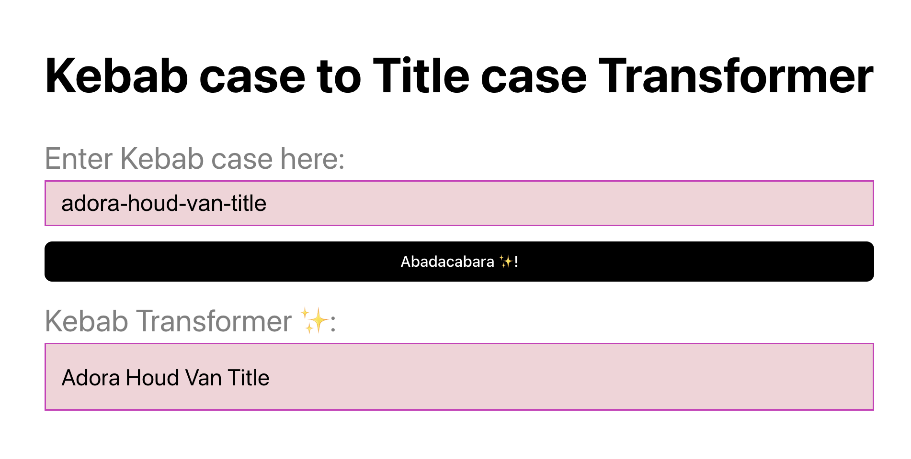

# Case Switching

Turn string from one kebab case to title case

## Kebab to Title

### Improvement - Future TODO

**Validation**

1. When user enters a non kebab sentence, prompt a warning message
2. When user enters more than 100 maxlength, prompt an error message.
3. Use form framework to achieve this: Formik or react-hook-form.
